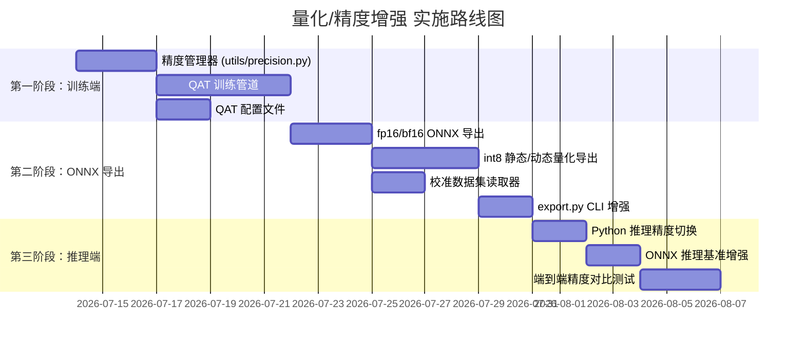

# 功能增强计划书 —— 量化训练 / 推理 / ONNX 导出（int8 / fp16 / bf16 / fp32）

> 版本：v1.0  
> 日期：2026-07-11  
> 适用范围：DSRX 仓库（基于 DiffSinger 架构）  

---

## 一、背景与动机

### 1.1 现状

DSRX 当前已支持通过 PyTorch Lightning 的 `pl_trainer_precision` 进行 **训练时混合精度**（`16-mixed` / `bf16-mixed`），但：

- **训练侧**：仅靠 Lightning 的 `autocast` 自动混合精度，缺少量化感知训练（QAT）和手动精度控制策略；
- **推理侧（Python）**：所有模块均为 `float32` 推理，未利用 fp16/bf16 加速，无 int8 量化推理路径；
- **推理侧（ONNX Runtime）**：导出时固定为 float32 图，未做 ONNX 级别的 Q/DQ 量化或 fp16 图优化；
- **部署基准**：`deployment/benchmarks/infer_acoustic.py` 仅做 float32 ONNX 推理的简单跑分。

### 1.2 目标

| 精度 | 训练支持 | Python 推理 | ONNX 导出 | ONNX 推理 |
|------|----------|-------------|-----------|-----------|
| fp32 | ✅ 已有 | ✅ 已有 | ✅ 已有 | ✅ 已有 |
| fp16 | ✅ 已有 (AMP) | ❌ 待实现 | ❌ 待实现 | ❌ 待实现 |
| bf16 | ✅ 已有 (AMP) | ❌ 待实现 | ❌ 待实现 | ❌ 待实现 |
| int8  | ❌ 待实现 (QAT) | ❌ 待实现 | ❌ 待实现 | ❌ 待实现 |

---

## 二、现有代码架构分析

### 2.1 模块全景

```
DSRX/
├── modules/
│   ├── commons/common_layers.py    ← 基础层（Linear, LayerNorm, EncSALayer, Mixed_LayerNorm）
│   ├── fastspeech/
│   │   ├── acoustic_encoder.py     ← FastSpeech2Acoustic（编码器 + 音素嵌入）
│   │   ├── tts_modules.py          ← FastSpeech2Encoder, TransformerEncoderLayer, DurationPredictor
│   │   └── param_adaptor.py        ← 参数适配器（方差嵌入）
│   ├── core/                       ← 扩散模型（DDPM / Reflow）
│   ├── backbones/                  ← LynxNet2, WaveNet backbone
│   ├── vocoders/                   ← 声码器接口
│   └── toplevel.py                 ← DiffSingerAcoustic（顶层模型）
├── deployment/
│   ├── modules/
│   │   ├── fastspeech2.py          ← FastSpeech2AcousticONNX（ONNX 导出版 FS2）
│   │   ├── diffusion.py            ← GaussianDiffusionONNX
│   │   ├── rectified_flow.py       ← RectifiedFlowONNX
│   │   ├── nsf_hifigan.py          ← NSFHiFiGANONNX
│   │   └── toplevel.py             ← DiffSingerAcousticONNX
│   ├── exporters/
│   │   ├── acoustic_exporter.py    ← 声学模型 ONNX 导出（torch.onnx.export）
│   │   └── nsf_hifigan_exporter.py ← 声码器 ONNX 导出
│   └── benchmarks/
│       └── infer_acoustic.py       ← ONNX Runtime 推理基准
├── inference/
│   ├── ds_acoustic.py              ← Python 推理入口
│   ├── ds_variance.py
│   └── dpm_solver_pytorch.py       ← DPM-Solver（扩散采样器）
├── training/
│   ├── acoustic_task.py            ← 训练任务
│   └── variance_task.py
├── basics/
│   ├── base_task.py                ← 训练器构建（pl.Trainer + precision）
│   └── base_exporter.py            ← 导出器基类
├── utils/
│   ├── onnx_helper.py              ← ONNX 图后处理工具
│   └── training_utils.py           ← get_strategy（精度策略）
└── configs/
    ├── original/base.yaml          ← pl_trainer_precision: '16-mixed'
    └── templates/config_acoustic.yaml
```

### 2.2 精度关键路径

```
训练:  config → base_task → pl.Trainer(precision='16-mixed') → Lightning AMP
导出:  export.py → acoustic_exporter → torch.onnx.export(..., opset_version=15, do_constant_folding=True)
推理:  ds_acoustic.py → model.eval().to(device) → 全 fp32 forward
ONNX:  ort.InferenceSession('model.onnx', providers=[...]) → float32 图
```

### 2.3 识别到的挑战

1. **PyTorch 导出限制**：当前 ONNX 导出固定使用 `torch.onnx.export` + opset 15，不支持直接导出带 Q/DQ 节点的量化图。需要引入 `onnxruntime.quantization` 或手动插入 Q/DQ 节点。
2. **Dynamic axes**：模型有动态序列长度（`n_tokens`, `n_frames`），int8 量化需校准数据集处理不同长度的输入。
3. **扩散采样循环**：扩散模型在 ONNX 中作为子图运行（多次迭代），量化时需确保循环体不被错误折叠。
4. **Mixed_LayerNorm**（最近移植）：条件 LayerNorm 中的 `F.layer_norm` + affine 线性变换在 fp16 下可能出现数值不稳定。

---

## 三、详细实现方案

### 3.1 第一阶段：训练端精度增强

#### 3.1.1 手动混合精度包装器（`utils/precision.py` 新建）

提供统一的精度上下文管理器，不依赖 Lightning：

```python
# utils/precision.py
class PrecisionContext:
    """统一精度管理器，支持 fp32 / fp16 / bf16"""
    def __init__(self, precision: str = 'fp32'):
        ...
    def autocast(self): ...
    def convert_model(self, model): ...
```

#### 3.1.2 量化感知训练（QAT）

- 使用 PyTorch 的 `torch.ao.quantization`：
  - **静态量化** (`torch.ao.quantization.fuse_modules` + `prepare_qat` + `convert`)
  - 需要 `qconfig` 指定 `torch.ao.quantization.QConfig(activation=..., weight=...)`
- 在 `configs/original/acoustic.yaml` 中新增配置项：
  ```yaml
  quantization:
    enabled: false
    backend: 'fbgemm'          # x86: fbgemm, ARM: qnnpack, GPU: tensorrt
    approach: 'static'         # static (需要校准) | dynamic (仅权重量化)
    qat_epochs: 10             # QAT 微调轮数
    activation_dtype: 'quint8'
    weight_dtype: 'qint8'
  ```
- 修改 `training/acoustic_task.py`：在 `configure_optimizers` 后插入 QAT 包装逻辑
- **关键注意**：`Embedding` 层（`NormalInitEmbedding`）需要特殊处理，通常保持 fp32

#### 3.1.3 影响范围

| 文件 | 修改内容 |
|------|----------|
| `utils/precision.py` | **新建** — PrecisionContext 类 |
| `configs/original/base.yaml` | 新增 `quantization` 配置块 |
| `configs/original/acoustic.yaml` | 同上 |
| `training/acoustic_task.py` | 添加 QAT 训练/转换逻辑 |
| `basics/base_module.py` | 实现 `get_float_module()` 用于取回 fp32 模型 |

---

### 3.2 第二阶段：ONNX 导出增强

#### 3.2.1 fp16 / bf16 ONNX 导出

**方案 A（推荐）：导出后转换**

```python
# 在 acoustic_exporter.py 中新增
import onnx
from onnxconverter_common import float16  # 或 onnxruntime.transformers

def _convert_to_fp16(self, model_onnx: ModelProto) -> ModelProto:
    """将 fp32 ONNX 图转换为 fp16"""
    return float16.convert_float_to_float16(model_onnx, keep_io_types=True)
```

**方案 B：原生 torch.onnx.export 指定 dtype**

```python
torch.onnx.export(
    model_fp16,
    dummy_input_fp16,
    ...
)
```

**流程图**：
```
ckpt (fp32) 
  → build_model (fp32)
  → model.half() 或 model.to(torch.bfloat16)
  → torch.onnx.export
  → onnxsim simplify
  → onnx.save (fp16/bf16 模型)
```

#### 3.2.2 int8 量化 ONNX 导出

使用 `onnxruntime.quantization`：

```python
from onnxruntime.quantization import quantize_static, QuantType, CalibrationDataReader

class AcousticCalibrationDataReader(CalibrationDataReader):
    """为 FS2+扩散模型提供校准数据"""
    def __init__(self, model, dataset, num_calibration_samples=100):
        ...

# 静态量化
quantize_static(
    model_input='model_fp32.onnx',
    model_output='model_int8.onnx',
    calibration_data_reader=AcousticCalibrationDataReader(...),
    quant_format=QuantType.QInt8,       # 或 QuantType.QInt8
    activation_type=QuantType.QInt8,
    weight_type=QuantType.QInt8,
    per_channel=True,
    reduce_range=True,
    # 排除扩散采样循环中的敏感算子
    nodes_to_exclude=['/diffusion/denoise_fn/...']
)
```

**动态量化（备选）**：
```python
from onnxruntime.quantization import quantize_dynamic

quantize_dynamic(
    model_input='model_fp32.onnx',
    model_output='model_int8_dynamic.onnx',
    weight_type=QuantType.QInt8,
    per_channel=True,
)
```

#### 3.2.3 导出器改动

修改 `deployment/exporters/acoustic_exporter.py`：

```python
class DiffSingerAcousticExporter(BaseExporter):
    def __init__(self, ..., precision='fp32', quantize=False, ...):
        ...
        self.export_precision = precision      # fp32 | fp16 | bf16
        self.export_quantize = quantize        # True → 附加导出 int8

    def export_model(self, path: Path):
        self._torch_export_model()             # 导出 torch 图
        fs2_onnx = self._optimize_fs2_aux_graph(...)
        diff_onnx = self._optimize_diffusion_graph(...)
        merged = self._merge_fs2_aux_diffusion_graphs(fs2_onnx, diff_onnx)
        
        # === 精度转换 ===
        if self.export_precision == 'fp16':
            merged = self._convert_to_fp16(merged)
        elif self.export_precision == 'bf16':
            merged = self._convert_to_bf16(merged)
        
        onnx.save(merged, path)
        
        # === 附加 int8 量化导出 ===
        if self.export_quantize:
            quantize_static(str(path), str(path).replace('.onnx', '_int8.onnx'), ...)

    def _convert_to_fp16(self, model_onnx):
        from onnxconverter_common import float16
        return float16.convert_float_to_float16(model_onnx, keep_io_types=True)
```

#### 3.2.4 影响范围

| 文件 | 修改内容 |
|------|----------|
| `deployment/exporters/acoustic_exporter.py` | 新增 precision 参数、fp16 转换、int8 量化 |
| `deployment/exporters/nsf_hifigan_exporter.py` | 同上 |
| `scripts/export.py` | 新增 `--precision`、`--quantize` CLI 参数 |
| `basics/base_exporter.py` | 新增 `_convert_dtype()` 抽象方法 |
| `utils/onnx_helper.py` | 新增 int8 Q/DQ 节点插入工具函数 |
| `utils/calibration.py` | **新建** — 校准数据集读取器 |

---

### 3.3 第三阶段：推理端精度支持

#### 3.3.1 Python 推理（`inference/ds_acoustic.py`）

当前推理：
```python
model = DiffSingerAcoustic(...).eval().to(self.device)
```

增强后：
```python
class DiffSingerAcousticInfer(BaseSVSInfer):
    def __init__(self, device=None, dtype='fp32', ...):
        self.dtype = self._resolve_dtype(dtype)
        model = DiffSingerAcoustic(...).eval().to(device=self.device, dtype=self.dtype)
    
    def _resolve_dtype(self, dtype: str):
        return {
            'fp32': torch.float32,
            'fp16': torch.float16,
            'bf16': torch.bfloat16,
        }[dtype]
    
    @torch.no_grad()
    def run_model(self, ...):
        with torch.autocast(device_type='cuda', dtype=self.dtype, enabled=(self.dtype != torch.float32)):
            ...
```

#### 3.3.2 ONNX Runtime 推理（`deployment/benchmarks/infer_acoustic.py`）

当前基准：
```python
session = ort.InferenceSession('model.onnx', providers=[provider])
```

增强后——支持多精度及 int8：

```python
class AcousticONNXInference:
    def __init__(self, onnx_path, precision='fp32'):
        providers = self._select_providers(precision)
        sess_options = ort.SessionOptions()
        sess_options.graph_optimization_level = ort.GraphOptimizationLevel.ORT_ENABLE_ALL
        
        if precision == 'fp16':
            sess_options.enable_mem_pattern = False
            # 需要 FP16 优化的执行提供器 (TensorRT / CUDA)
        elif precision == 'int8':
            # 使用 QDQ 量化模型，需要支持 QDQ 的 EP
        
        self.session = ort.InferenceSession(onnx_path, sess_options, providers=providers)
    
    def _select_providers(self, precision):
        if precision == 'fp16':
            return ['TensorrtExecutionProvider', 'CUDAExecutionProvider']
        elif precision == 'int8':
            return ['TensorrtExecutionProvider', 'CPUExecutionProvider']
        else:
            return ['CUDAExecutionProvider', 'CPUExecutionProvider']
```

#### 3.3.3 影响范围

| 文件 | 修改内容 |
|------|----------|
| `inference/ds_acoustic.py` | 新增 dtype 选择、autocast 推理 |
| `inference/ds_variance.py` | 同上 |
| `basics/base_svs_infer.py` | 新增 `_resolve_dtype()` 方法 |
| `deployment/benchmarks/infer_acoustic.py` | 重构为精度感知推理器，新增 int8/fp16/bf16 基准 |
| `scripts/infer.py` | 新增 `--precision` CLI 参数 |

---

## 四、实施路线图



### 里程碑

| 里程碑 | 交付物 | 验收标准 |
|--------|--------|----------|
| M1: 训练精度基础设施 | `utils/precision.py` + QAT 管道 | QAT 训练可收敛，loss 与 fp32 基线偏差 < 5% |
| M2: ONNX 多精度导出 | fp16/bf16/int8 .onnx 文件 | `onnx.checker.check_model()` 通过 |
| M3: 推理精度切换 | Python/ONNX 推理支持 4 种精度 | 各精度推理结果与 fp32 基线 mel 谱 RMSE < 0.01 |
| M4: 端到端量化部署 | int8 ONNX + 量化声码器 | 端到端合成音质通过主观评估 |

---

## 五、风险与缓解措施

| 风险 | 严重程度 | 缓解措施 |
|------|----------|----------|
| fp16 下 LayerNorm 数值不稳定 | 🔴 高 | 关键 LayerNorm 保持 fp32；对 `Mixed_LayerNorm` 的 `F.layer_norm` 做 upcast |
| int8 量化精度损失过大 | 🟡 中 | 逐层分析敏感算子；扩散 backbone 可用 per-channel 量化 + 校准调优 |
| BF16 在旧 GPU / CPU 上不支持 | 🟡 中 | 提供自动降级逻辑（bf16 → fp32 回退） |
| ONNX opset 兼容性（Q/DQ 需要 opset ≥ 13） | 🟢 低 | 已使用 opset 15，满足要求 |
| 动态序列长度导致校准数据不覆盖 | 🟡 中 | 校准时覆盖 min~max 长度范围，多 batch size 组合 |
| `onnxconverter_common.float16` 转换引入 NaN | 🟡 中 | 转换后做 NaN 检测 + 逐节点回退 |

---

## 六、新增/修改文件清单

| 文件路径 | 操作 | 说明 |
|----------|------|------|
| `utils/precision.py` | **新建** | PrecisionContext、自动降级、QAT 工具 |
| `utils/calibration.py` | **新建** | ONNX 量化校准数据集读取器 |
| `configs/original/base.yaml` | 修改 | 新增 `quantization` 配置块 |
| `configs/original/acoustic.yaml` | 修改 | 同上 |
| `basics/base_task.py` | 修改 | 集成 QAT 训练逻辑 |
| `basics/base_exporter.py` | 修改 | 新增精度转换抽象方法 |
| `basics/base_svs_infer.py` | 修改 | 新增 dtype 解析方法 |
| `training/acoustic_task.py` | 修改 | QAT 训练钩子 |
| `deployment/exporters/acoustic_exporter.py` | 修改 | fp16/bf16/int8 导出 |
| `deployment/exporters/nsf_hifigan_exporter.py` | 修改 | 同上 |
| `deployment/benchmarks/infer_acoustic.py` | 重写 | 精度感知基准测试 |
| `scripts/export.py` | 修改 | `--precision` / `--quantize` CLI |
| `scripts/infer.py` | 修改 | `--precision` CLI |
| `inference/ds_acoustic.py` | 修改 | dtype 选择 + autocast |
| `inference/ds_variance.py` | 修改 | 同上 |
| `utils/onnx_helper.py` | 修改 | Q/DQ 节点插入工具 |

---

## 七、配置示例

### 7.1 训练配置（`configs/original/acoustic.yaml` 新增部分）

```yaml
# ====== 精度控制 ======
pl_trainer_precision: 'bf16-mixed'   # 现有：'32-true' | '16-mixed' | 'bf16-mixed'

# ====== 量化感知训练 ======
quantization:
  enabled: false                      # 启用 QAT
  backend: 'fbgemm'                   # x86 CPU: fbgemm | ARM: qnnpack | GPU 训练: None
  approach: 'static'                  # static (QAT) | dynamic (仅校准后量化)
  qat_epochs: 10                      # QAT 微调 epoch 数
  activation_dtype: 'quint8'
  weight_dtype: 'qint8'
  fuse_modules: true                  # 自动 Conv-BN-ReLU 融合
  exclude_layers:                     # 保持 fp32 的层
    - 'txt_embed'
    - 'spk_embed'
    - 'lang_embed'
```

### 7.2 导出命令

```bash
# fp32 导出（现有行为）
python scripts/export.py acoustic --exp my_exp --out ./export

# fp16 导出
python scripts/export.py acoustic --exp my_exp --out ./export --precision fp16

# fp32 + fp16 + int8 同时导出
python scripts/export.py acoustic --exp my_exp --out ./export --precision all --quantize

# 仅 int8（基于已有 fp32 ONNX）
python scripts/export.py acoustic --exp my_exp --out ./export --quantize-only
```

### 7.3 推理命令

```bash
# fp16 推理
python scripts/infer.py --exp my_exp --precision fp16 --spk speaker1 --text "歌词..."

# int8 ONNX 推理
python scripts/infer.py --exp my_exp --onnx ./export/model_int8.onnx --precision int8
```

---

## 八、验收测试

### 8.1 数值精度

| 测试项 | 方法 | 阈值 |
|--------|------|------|
| fp16 推理 vs fp32 | 相同输入下 mel 谱余弦相似度 | ≥ 0.999 |
| bf16 推理 vs fp32 | 同上 | ≥ 0.999 |
| int8 推理 vs fp32 | 同上 | ≥ 0.99 |
| QAT 训练 loss vs 无量化基线 | 最终 loss 相对偏差 | ≤ 5% |

### 8.2 性能基准

基准测试脚本 `deployment/benchmarks/infer_acoustic.py` 重构后将对比：

| 精度 | 后端 | 预期加速比 (vs fp32) |
|------|------|----------------------|
| fp16 | CUDA / TensorRT | 1.5× ~ 2× |
| bf16 | CUDA (Ampere+) | 1.3× ~ 1.8× |
| int8 | TensorRT / CPU | 2× ~ 4× |

### 8.3 主观听感

- 各精度导出的模型需通过 A/B 盲听测试
- int8 量化模型合成质量不得有明显可感知的退化

---

## 九、依赖项

新增 Python 包（加入 `requirements.txt` 和 `requirements-onnx.txt`）：

```
# 量化训练
torch>=2.0.0                    # 需要 torch.ao.quantization

# ONNX fp16 转换
onnxconverter-common>=1.14.0

# ONNX int8 量化
onnxruntime>=1.18.0

# 精度测试
onnxruntime-extensions>=0.10.0  # 可选，用于 ONNX 端到端基准
```

---

## 十、参考资料

- [PyTorch Quantization API](https://pytorch.org/docs/stable/quantization.html)
- [ONNX Runtime Quantization](https://onnxruntime.ai/docs/performance/quantization.html)
- [onnxconverter-common float16](https://github.com/microsoft/onnxconverter-common)
- [TensorRT INT8 Calibration](https://docs.nvidia.com/deeplearning/tensorrt/developer-guide/index.html#int8-calib)
- [Mixed_LayerNorm paper (Interspeech 2024)](https://www.isca-archive.org/interspeech_2024/hwang24_interspeech.pdf)
